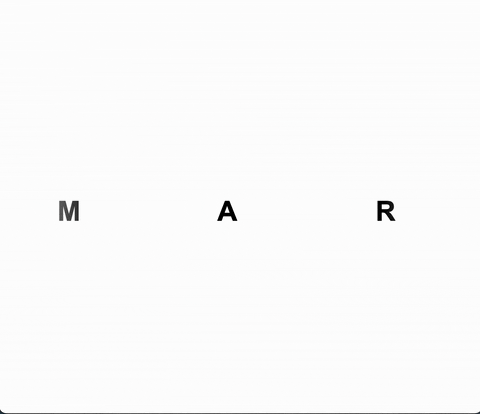

# Marquee Component Animation

[](https://opensource.org/licenses/MIT)
[]()
[]()

---

## Description

A simple, customizable horizontal marquee animation built with HTML and CSS. This project demonstrates how to create a smooth, performant scrolling effect for lists or banners, ideal for portfolios, news tickers, or feature highlights.

## Features

- Pure CSS horizontal scrolling animation
- Edge fade effect using CSS masks
- Easily customizable speed, item count, and appearance

## Demo


<!-- Or link to a live demo if available -->

## Getting Started

### Prerequisites

- A modern web browser (Chrome, Firefox, Safari, Edge)
- No build tools or dependencies required

### Installation

```bash
# Clone the repository
git clone https://github.com/mbportz/projects.git

# Navigate to the project directory
cd cd projects/marquee