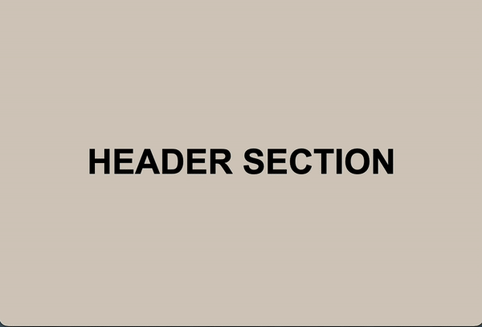

# Scroll to Top Button Demo

This project demonstrates a simple "Back to Top" button component using web development basics. The button appears when you scroll down the page and allows users to quickly return to the top with a smooth scrolling animation.

## Features

- **Visibility on Scroll:** The button only appears after scrolling down a certain distance.
- **Smooth Scroll:** Clicking the button smoothly scrolls the page back to the top.
- **Simple Styling:** Easy to customize and integrate into any webpage.

## Usage

1. Clone or download this repository.
2. Open `index.html` in your browser.
3. Scroll down the page to see the "Back to Top" button appear in the bottom corner.
4. Click the button to smoothly scroll back to the top.

## Customization

- You can adjust the scroll threshold, button style, and animation in the source files.

## Example

---

Feel free to use or modify this component in your own projects!